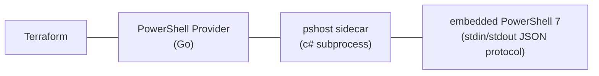

# Terraform Provider: PowerShell

A Terraform provider that manages resources through PowerShell scriptblocks. Define CRUD operations as PowerShell scripts, receive inputs through a bound `$InputData` parameter, emit a single result object to the PowerShell output stream, and manage any resource that PowerShell can reach.

## Architecture



The provider starts a single, long-lived `pshost` process during `terraform init`/`plan`/`apply`. `pshost` is a self-contained executable that **embeds PowerShell 7 and the .NET runtime**, so no PowerShell or .NET installation is required on the host — the provider runs on any OS/architecture Terraform supports (Linux, macOS, Windows; amd64 and arm64). All resource operations execute sequentially through this process, sharing provider-level state (credentials, connections, modules). A mutex ensures only one resource operation runs at a time.

## Requirements

- [Terraform](https://www.terraform.io/downloads) >= 1.0

No runtime dependencies: the matching `pshost` sidecar is bundled in each provider release and embeds PowerShell 7, so PowerShell does **not** need to be installed separately.

Building from source additionally requires:

- [Go](https://golang.org/doc/install) >= 1.21
- [.NET SDK](https://dotnet.microsoft.com/download) >= 9.0 (to build the `pshost` sidecar)
- [PowerShell 7+](https://github.com/PowerShell/PowerShell) is optional, only handy for authoring/testing scripts locally

## Installation

### From Source

```bash
git clone https://github.com/markdomansky/terraform-provider-powershell.git
cd terraform-provider-powershell
go build -o terraform-provider-powershell
```

Place the binary in your [Terraform plugin directory](https://developer.hashicorp.com/terraform/cli/config/config-file#implied-local-mirror-directories) or use a `dev_overrides` block in your Terraform CLI config:

```hcl
# ~/.terraformrc
provider_installation {
  dev_overrides {
    "registry.terraform.io/markdomansky/powershell" = "/path/to/binary/directory"
  }
  direct {}
}
```

## Provider Configuration

```hcl
provider "powershell" {
  # Optional: Script to run once during provider initialization.
  # Use to authenticate, load modules, or set shared state in $global:ProviderState.
  startup_script = file("${path.module}/scripts/init.ps1")

  # Optional: Script to run once when the provider tears down, after all
  # resources have finished. Runs in the same process as the startup script and
  # every resource, so it can read $global:ProviderState to clean up.
  shutdown_script = file("${path.module}/scripts/cleanup.ps1")

  # Optional: Default timeout for all script executions (seconds). Default: 3600
  timeout = 3600
}
```

Both `startup_script` and `shutdown_script` are shared by every resource: the
startup script runs exactly once before any resource operation, and the shutdown
script runs exactly once after the last one — all within the same persistent
PowerShell process.

### Startup Script Example

The startup script authenticates once and stashes shared state in
`$global:ProviderState` for every resource script to read:

```powershell
# scripts/init.ps1
$global:ProviderState = @{}
Import-Module Az.Accounts
Connect-AzAccount -Identity
$global:ProviderState["subscription"] = (Get-AzContext).Subscription.Id
```

The script has no dedicated credential argument — it's just a PowerShell string,
so credentials are passed by interpolating Terraform variables or by reading
`$env:` values from the provider process. See
[Passing credentials to the startup script](docs/index.md#passing-credentials-to-the-startup-script)
in the docs for the full pattern, including how to keep secrets out of state.

### Shared Scripts Across Multiple Resources

The `startup_script` and `shutdown_script` run **once per Terraform run**, not
once per resource. Every `powershell_script` resource shares the same persistent
PowerShell process, so any state the startup script puts in
`$global:ProviderState` is visible to all of them:

```hcl
provider "powershell" {
  startup_script  = file("${path.module}/scripts/init.ps1")     # connects once
  shutdown_script = file("${path.module}/scripts/cleanup.ps1")  # disconnects once
}

resource "powershell_script" "web" {
  create_script = <<-PS
    $sub = $global:ProviderState["subscription"]   # shared from init.ps1
    [PSCustomObject]@{ id = "web"; subscription = $sub }
  PS
  read_script   = "..."
  update_script = "..."
  delete_script = "..."
}

resource "powershell_script" "db" {
  create_script = <<-PS
    $sub = $global:ProviderState["subscription"]   # same shared connection
    [PSCustomObject]@{ id = "db"; subscription = $sub }
  PS
  read_script   = "..."
  update_script = "..."
  delete_script = "..."
}
```

`init.ps1` connects a single time before `web` and `db` are created, and
`cleanup.ps1` disconnects a single time after the last one is processed. See
[Sharing state across multiple resources](docs/index.md#sharing-state-across-multiple-resources)
in the docs for a complete walkthrough, including isolation guarantees.

## Resource: `powershell_script`

Manages a resource through PowerShell CRUD scriptblocks.

### Schema

| Attribute               | Type          | Required | Description |
|-------------------------|---------------|----------|-------------|
| `create_script`         | String        | Yes      | Script for resource creation. Must emit exactly one object to the output stream whose `id` field is a non-empty string. Changes do not replace the resource; use `triggers`. |
| `read_script`           | String        | Yes      | Script to read current state. Must emit exactly one object. Emit nothing to signal resource is gone. |
| `update_script`         | String        | No       | Script for in-place updates, run when `input_data`/`sensitive_input_data` change. Must emit exactly one object. When omitted, input changes force a replacement. |
| `delete_script`         | String        | Yes      | Script for resource deletion. |
| `input_data`            | String (JSON) | No       | Input data delivered to scripts through the bound `$InputData` parameter (a hashtable). Use `jsonencode()`. |
| `sensitive_input_data`  | String (JSON) | No       | Sensitive input, merged into `$InputData` after `input_data` (sensitive wins on collision). Redacted from plan output; still stored in state. |
| `output_data`           | String (JSON) | Computed | The single object the script emitted, excluding the reserved `sensitive` key. Use `jsondecode()` to extract values. Must include `id` key/value.|
| `sensitive_output_data` | String (JSON) | Computed | The value the script emitted under the reserved top-level `sensitive` key (`"{}"` when absent). Redacted from plan output. |
| `triggers`              | Map(String)   | No       | Map of values that force recreation when changed. |
| `timeout`               | Number        | No       | Per-resource timeout override (seconds). |

A read-only **`powershell_script` data source** is also available for scripts that
only fetch data — see [docs/data-sources/script.md](docs/data-sources/script.md).

### Script Contract

A CRUD script receives its inputs through a **bound `$InputData` parameter** — the host
injects a `param($InputData)` block automatically, so do **not** write your own
`param(...)` block. It returns its result by **emitting exactly one object to the
output (success) stream** — typically `[PSCustomObject]@{ id = '...'; ... }`. There is no
`$OutputData` variable. The following are available inside any CRUD scriptblock:

| Name                     | Type      | Description |
|--------------------------|-----------|-------------|
| `$InputData`             | Hashtable | Bound parameter parsed from `input_data` JSON. On read/update/delete, also includes `id`. |
| `$global:ProviderState`  | Hashtable | Shared state from `startup_script`. Persists across all operations. |
| `$Action`                | String    | Current action: `"create"`, `"read"`, `"update"`, or `"delete"`. |

**Emitting output:** emit **exactly one** object to the output stream. A create script's
emitted object must have an `id` field that is a non-empty string. Emitting **nothing**
from a read script signals the resource is gone (Terraform removes it from state). If a
script emits **more than one** object — for example because a cmdlet leaked its result —
the operation **fails**; pipe stray cmdlet output to `Out-Null` to suppress it. All other
PowerShell streams (Information/Warning/Verbose/Debug) are captured for diagnostics, and
**any record written to the error stream marks the operation as failed**, even without a
thrown terminating error.

> **Isolation:** CRUD scripts run in an isolated child scope. `$global:ProviderState`
> is captured after the script runs, but any *other* variables a script creates are
> discarded when it finishes, so they cannot leak into the next resource's script. The
> only sanctioned channel for state that must survive between operations is
> `$global:ProviderState` (which your `startup_script` creates, e.g.
> `$global:ProviderState = @{}`, and which lives in the persistent runspace for the
> whole run). If a script fails, its emitted output is dropped, so a failed operation
> never returns stale data. Note that `$global:ProviderState` is **not** rolled back
> on failure — any mutations a failing script made to it persist for later operations.

### Basic Example

```hcl
resource "powershell_script" "example" {
  # Scripts use cross-platform PowerShell 7 cmdlets and a portable temp path,
  # so this works identically on Linux, macOS, and Windows.
  create_script = <<-PS
    $path = Join-Path ([System.IO.Path]::GetTempPath()) $InputData.name
    New-Item -Path $path -ItemType File -Value "managed" -Force | Out-Null
    [PSCustomObject]@{
      id   = $InputData.name
      path = $path
    }
  PS

  read_script = <<-PS
    $path = Join-Path ([System.IO.Path]::GetTempPath()) $InputData.id
    if (Test-Path $path) {
      [PSCustomObject]@{
        id   = $InputData.id
        path = $path
      }
    }
  PS

  update_script = <<-PS
    $path = Join-Path ([System.IO.Path]::GetTempPath()) $InputData.id
    Set-Content -Path $path -Value $InputData.content
    [PSCustomObject]@{
      id      = $InputData.id
      content = $InputData.content
    }
  PS

  delete_script = <<-PS
    $path = Join-Path ([System.IO.Path]::GetTempPath()) $InputData.id
    Remove-Item -Path $path -Force -ErrorAction SilentlyContinue
  PS

  input_data = jsonencode({
    name    = "my-resource"
    content = "hello world"
  })
}

output "resource_path" {
  value = jsondecode(powershell_script.example.output_data).path
}
```

## Submodule Pattern (Recommended)

The recommended way to use this provider is to create **reusable Terraform modules** that bundle scripts with typed variables:

```
modules/
└── managed-file/
    ├── main.tf          # powershell_script resource
    ├── variables.tf     # Typed inputs (file_path, content, etc.)
    ├── outputs.tf       # Extracted outputs
    └── scripts/
        ├── create.ps1
        ├── read.ps1
        ├── update.ps1
        └── delete.ps1
```

### Module Definition (`modules/managed-file/main.tf`)

```hcl
resource "powershell_script" "this" {
  create_script = file("${path.module}/scripts/create.ps1")
  read_script   = file("${path.module}/scripts/read.ps1")
  update_script = file("${path.module}/scripts/update.ps1")
  delete_script = file("${path.module}/scripts/delete.ps1")

  input_data = jsonencode({
    file_path = var.file_path
    content   = var.content
  })

  triggers = {
    content_hash = sha256(var.content)
  }
}
```

> **Passing variables into script files:** Terraform reads `file(...)` contents
> verbatim, so `${var.name}` inside a `.ps1` file is **not** interpolated. Pass
> values through `input_data` and read them from the `$InputData` parameter (the script
> above reads `$InputData.file_path`). See
> [Passing variables to script files](docs/resources/script.md#passing-variables-to-script-files)
> for the full pattern, including `templatefile()` when you genuinely need
> interpolation.

### Usage

```hcl
module "config" {
  source    = "./modules/managed-file"
  file_path = "/etc/myapp/config.json"
  content   = jsonencode({ port = 8080 })
}

output "config_id" {
  value = module.config.resource_id
}
```

### Benefits

- **Reusable**: Same module manages any file, just change variables
- **Typed**: Terraform validates inputs before scripts run
- **Testable**: Scripts can be tested independently with Pester
- **Versionable**: Pin module versions, track changes in git
- **Encapsulated**: Consumers don't see PowerShell details

### Targeting two provider aliases from one module

A module can act against two independent targets (e.g. a primary and a replica,
or two tenants) by declaring alias slots and letting each resource pick one:

```hcl
# modules/replicated-record/main.tf
terraform {
  required_providers {
    powershell = {
      source                = "markdomansky/powershell"
      configuration_aliases = [powershell.primary, powershell.replica]
    }
  }
}

resource "powershell_script" "primary" {
  provider      = powershell.primary
  # ...create/read/update/delete scripts...
}

resource "powershell_script" "replica" {
  provider      = powershell.replica
  # ...same scripts, routed to the replica configuration...
}
```

The caller binds those slots to two aliased configurations — each an isolated
sidecar with its own `$global:ProviderState` — via a `providers` map:

```hcl
module "config_record" {
  source = "./modules/replicated-record"
  providers = {
    powershell.primary = powershell.primary
    powershell.replica = powershell.replica
  }
}
```

See [Using two provider aliases in a submodule](docs/index.md#using-two-provider-aliases-in-a-submodule)
in the docs for the complete example, including per-alias `startup_script`
connections and how the script reads its alias's state.

## Patterns and Practices

### Credential Management

Pass credentials through the provider startup script and access them in resource scripts:

```hcl
provider "powershell" {
  startup_script = <<-PS
    $global:ProviderState = @{}
    # Store credentials in provider state (NOT in Terraform state)
    $global:ProviderState["api_key"] = $env:API_KEY
    $global:ProviderState["api_url"] = $env:API_URL
  PS
}
```

```powershell
# In any CRUD script:
$headers = @{ "Authorization" = "Bearer $($global:ProviderState['api_key'])" }
$baseUrl = $global:ProviderState["api_url"]
```

### Idempotent Scripts

Write scripts that are safe to run multiple times:

```powershell
# create.ps1 - Check before creating
$existing = Get-Something -Name $InputData.name -ErrorAction SilentlyContinue
if ($existing) {
    # Already exists - just emit output
    [PSCustomObject]@{ id = $existing.Id }
} else {
    $new = New-Something -Name $InputData.name
    [PSCustomObject]@{ id = $new.Id }
}
```

### Error Handling

Scripts that `throw` or hit terminating errors will cause the Terraform operation to fail with the error message. Writing any record to the error stream also marks the operation as failed, even without a thrown terminating error:

```powershell
# Validate inputs
if (-not $InputData.name) {
    throw "input_data must include 'name'"
}

# Use -ErrorAction Stop to make cmdlet errors terminating
$result = Invoke-WebRequest -Uri $url -ErrorAction Stop
```

### Read Script for Drift Detection

The read script is called during `terraform plan` to detect drift. Emit nothing if the resource no longer exists:

```powershell
# read.ps1
$resource = Get-MyResource -Id $InputData.id -ErrorAction SilentlyContinue
if ($resource) {
    [PSCustomObject]@{
        id     = $resource.Id
        status = $resource.Status
    }
}
# If $resource is null, the script emits nothing -> Terraform marks as deleted
```

### Triggers for Script Changes

Use triggers to force recreation when scripts change:

```hcl
resource "powershell_script" "example" {
  # ...scripts...

  triggers = {
    create_hash = sha256(file("${path.module}/scripts/create.ps1"))
    read_hash   = sha256(file("${path.module}/scripts/read.ps1"))
    config_hash = sha256(jsonencode(local.config))
  }
}
```

## Testing

### Run Go Unit Tests

```bash
go test ./internal/provider/ -v -timeout 120s
```

### Run Pester Tests

```powershell
Invoke-Pester ./tests/pester/ -Output Detailed
```

### Run Terraform Acceptance Tests

```bash
TF_ACC=1 go test ./tests/ -v -timeout 600s
```

## Development

```bash
# Build
go build -o terraform-provider-powershell

# Run all tests
go test ./... -timeout 120s

# Run Pester tests
pwsh -Command 'Invoke-Pester ./tests/pester/ -Output Detailed'
```

## How It Works

1. **Provider Configure**: Starts a persistent `pshost` sidecar (a self-contained executable with PowerShell 7 embedded) running a responder loop. Optionally executes a startup script.
2. **Command Protocol**: Each CRUD operation sends a JSON command to the `pshost` process via stdin, delimited by `###PS_CMD_START###` / `###PS_CMD_END###` markers.
3. **Script Execution**: The responder parses the command, binds the `$InputData` parameter and sets `$Action` (and `$global:ProviderState`), runs the scriptblock in an isolated child scope (for CRUD actions), and captures the single object the script emits to its output stream. Other streams are captured for diagnostics, and any error-stream record fails the operation.
4. **Response Protocol**: The responder writes a JSON response between `###PS_RSP_START###` / `###PS_RSP_END###` markers.
5. **Serial Execution**: A Go mutex ensures only one resource operation executes at a time, preventing race conditions in the shared PowerShell runspace.
6. **Cleanup**: When Terraform finishes, the provider runs the optional `shutdown_script` (once, in the same process) and then closes stdin, causing the responder loop to exit gracefully.

## License

MPL-2.0
