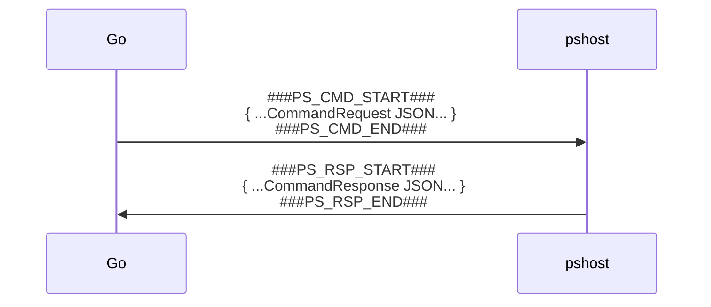
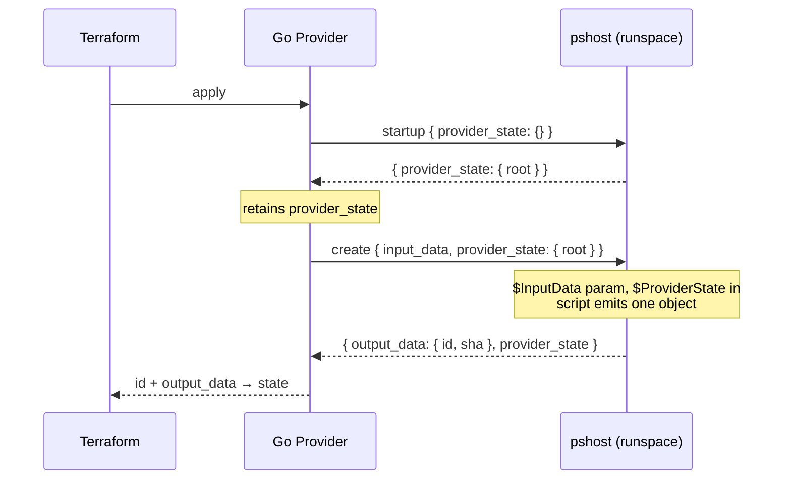

# PSHost — PowerShell sidecar for the Terraform provider

This directory contains the **pshost** sidecar: a small .NET 9 console application
that hosts a live PowerShell runspace and executes scripts on behalf of the
Go-based Terraform provider in this repository.

It exists so the provider can run **real PowerShell** without requiring a system
PowerShell install or a .NET runtime on the target machine. The project publishes
a **self-contained, single-file executable per platform**, which Terraform ships
alongside the provider binary and launches as a child process.

## Why a sidecar?

The Terraform provider is written in Go, but the resources it manages are defined
by user-supplied PowerShell scripts. Rather than shelling out to `pwsh` for every
operation (slow, and an external dependency), the provider starts **one**
long-lived `pshost` process and talks to it over stdin/stdout.

Keeping a single process — and a single runspace — alive for the whole Terraform
run gives two things:

- **Speed:** the runspace is opened once, not per resource operation.
- **Shared state:** any `$global:*` variable a script creates (by convention a
  `$global:ProviderState` hashtable the `startup_script` initializes, e.g.
  `$global:ProviderState = @{}`) survives in the persistent runspace across every
  create/read/update/delete, so scripts can stash things like auth tokens,
  connections, or caches and reuse them.

The Go side that drives this process lives in
[`internal/provider/ps_manager.go`](../internal/provider/ps_manager.go).

## Projects

| Project | Description |
| --- | --- |
| [`PSHost/`](PSHost/) | The sidecar executable (`pshost` / `pshost.exe`). |
| [`PSHost.Tests/`](PSHost.Tests/) | xUnit unit and integration tests. |

There is no `.sln` file; build/test by pointing `dotnet` at the project files.

## Source files

### `PSHost/Program.cs`

The process entry point and the **stdin/stdout protocol loop**. It:

1. Opens a single `RunspaceManager`.
2. Prints the `###PS_READY###` marker so the caller knows it's listening.
3. Loops: read a framed command, execute it, write a framed response.
4. Exits cleanly on the literal line `exit`, on EOF, or on a broken pipe.

All JSON (de)serialization uses snake_case to match the Go struct tags. A bad or
unparseable command is turned into a failed response rather than crashing the
host, so one malformed command can never take the sidecar down.

### `PSHost/RunspaceManager.cs`

Owns the persistent PowerShell runspace and does the actual work:

- Sets the well-known script state (`$Action` and `$ErrorActionPreference = 'Stop'`)
  and injects a `param($InputData)` block so the script receives its inputs through a
  bound `$InputData` parameter. The host does **not** pre-create `$global:ProviderState`
  — scripts create their own globals (by convention the `startup_script` runs
  `$global:ProviderState = @{}`), and because the runspace is persistent they survive
  across every later operation.
- `Execute(CommandRequest)` resets the per-call state, runs the script (binding
  `$InputData`), and collects the script's **output (success) stream**.
  A successful operation must emit **exactly one** object; emitting more than one
  fails the call. Any record on the **error stream** — terminating or not — also
  produces a failed `CommandResponse`. Other streams (Information/Warning/Verbose/
  Debug) are captured for diagnostics.
- Converts data both ways between JSON-deserialized .NET types and
  PowerShell-friendly `Hashtable`/`PSObject` values (`ConvertToHashtable`,
  `ConvertFromPSObject`, and helpers), recursing through nested objects and arrays.

It also defines the two DTOs exchanged with Go: `CommandRequest` and
`CommandResponse`.

## The wire protocol

Communication is line-delimited and framed with marker strings. These markers are
defined identically in `Program.cs`, `ps_manager.go`, and the integration tests —
**if you change one, change them all.**



On startup, pshost emits a single `###PS_READY###` line. The Go side blocks until
it sees that marker before sending any commands. Lines that fall outside the
markers (e.g. stray `Write-Host` output from a script) are ignored by the reader.

### Command (`CommandRequest` / Go `PSCommand`)

| JSON field | Meaning | Script variable |
| --- | --- | --- |
| `action` | Operation name (`create`, `read`, `update`, `delete`, `startup`, `shutdown`, …) | `$Action` |
| `script` | PowerShell to execute | — |
| `input_data` | Per-operation inputs | `$InputData` parameter (host-injected `param` block) |
| `provider_state` | Provider-wide state bag | `$global:ProviderState` |

### Response (`CommandResponse` / Go `PSResponse`)

| JSON field | Meaning |
| --- | --- |
| `success` | `false` if the script threw, wrote to the error stream, or emitted more than one object |
| `output_data` | The single object the script emitted to its output stream |
| `provider_state` | `$ProviderState` after the script ran (echoed back to keep Go in sync) |
| `error` | Error message when `success` is false |

### A script's contract

A script receives `$InputData` (a bound parameter — the host injects the
`param($InputData)` block, so scripts must **not** declare their own) and `$Action`,
and returns its result by **emitting exactly one object to the output (success)
stream**. Shared globals such as `$global:ProviderState` are not provided by the host;
they are whatever the `startup_script` created (e.g. `$global:ProviderState = @{}`) and
left in the persistent runspace. There is no `$OutputData` variable:

```powershell
# A trivial "create": emit inputs back as outputs
[PSCustomObject]@{
    id       = $InputData.name
    location = $InputData.location
}

# Persist something for later operations in the same Terraform run
$global:ProviderState['token'] = 'abc123'

# Pipe any stray cmdlet output to Out-Null so only one object reaches the stream
```

## Worked example: a `powershell_script` resource, end to end

This section traces one concrete provider + resource combo through `pshost`,
showing the exact JSON that crosses the wire in each direction. The provider has a
startup script that stashes a shared root path, and a single resource that writes a
config file under it.

```hcl
provider "powershell" {
  # Runs once, before any resource. Creates and seeds shared state for every script.
  startup_script = <<-PS
    $global:ProviderState = @{}
    $global:ProviderState['root'] = 'C:\data'
  PS
}

resource "powershell_script" "config_file" {
  # Encoded to JSON and sent as the command's input_data.
  input_data = jsonencode({
    name    = "app.config"
    content = "loglevel=info"
  })

  create_script = <<-PS
    $path = Join-Path $ProviderState.root $InputData.name
    Set-Content -Path $path -Value $InputData.content -NoNewline
    [PSCustomObject]@{
      id   = $path
      sha  = (Get-FileHash -Path $path -Algorithm SHA256).Hash
    }
  PS

  read_script = <<-PS
    if (-not (Test-Path $InputData.id)) { return }   # emit nothing -> resource gone
    [PSCustomObject]@{
      id   = $InputData.id
      sha  = (Get-FileHash -Path $InputData.id -Algorithm SHA256).Hash
    }
  PS

  update_script = "..."
  delete_script = "Remove-Item -Path $InputData.id -ErrorAction SilentlyContinue"
}
```

### What `terraform apply` sends through `pshost`

Two commands cross the wire on a fresh apply: the provider's **startup** (once,
when the sidecar is configured) and the resource's **create**.

**1. Startup — Go → pshost.** `provider_state` starts empty; the script seeds it.

```json
{
  "action": "startup",
  "script": "$global:ProviderState = @{}\n$global:ProviderState['root'] = 'C:\\data'",
  "input_data": null,
  "provider_state": {}
}
```

**Startup — pshost → Go.** The mutated `provider_state` is echoed back; the Go
`PSManager` retains it and carries it into every later command.

```json
{
  "success": true,
  "output_data": {},
  "provider_state": { "root": "C:\\data" },
  "error": ""
}
```

**2. Create — Go → pshost.** `input_data` is the decoded `jsonencode(...)` map,
and `provider_state` is the value retained from startup — this is how the create
script sees `$ProviderState.root` even though it never set it.

```json
{
  "action": "create",
  "script": "$path = Join-Path $ProviderState.root $InputData.name\n...",
  "input_data": {
    "name": "app.config",
    "content": "loglevel=info"
  },
  "provider_state": { "root": "C:\\data" }
}
```

Inside the script the request fields land as PowerShell variables:

| Wire field | Script variable | Value for this call |
| --- | --- | --- |
| `action` | `$Action` | `"create"` |
| `input_data.name` | `$InputData.name` | `"app.config"` |
| `input_data.content` | `$InputData.content` | `"loglevel=info"` |
| `provider_state.root` | `$ProviderState.root` | `"C:\data"` |

**Create — pshost → Go.** The single object the script emitted to its output stream comes
back as `output_data`. The `id` key is mandatory on create — the Go provider rejects the
resource without it (`resource_script.go`) — and becomes the Terraform resource id.

```json
{
  "success": true,
  "output_data": {
    "id":  "C:\\data\\app.config",
    "sha": "A1B2C3…"
  },
  "provider_state": { "root": "C:\\data" },
  "error": ""
}
```

The provider stores `output_data` as the resource's `output_data` attribute (a JSON
string you read back with `jsondecode()`), and `id` as the resource id.

### Where `id` comes from on later operations

`read`, `update`, and `delete` are **not** given a fresh `id` by your config — the
Go provider injects the stored id into `input_data` before the call, so the script
can always find what to act on:

```json
{
  "action": "read",
  "script": "if (-not (Test-Path $InputData.id)) { ... }",
  "input_data": {
    "name": "app.config",
    "content": "loglevel=info",
    "id": "C:\\data\\app.config"
  },
  "provider_state": { "root": "C:\\data" }
}
```

If a `read` returns an **empty** `output_data` (or one with no `id`), the provider
treats the resource as gone and removes it from state, prompting a recreate on the
next plan.

### The round-trip, end to end



> **Failure semantics:** if a script throws or writes to the error stream, the
> response has `success: false`, an `error` message, **empty** `output_data`, and
> the **pre-call** `provider_state` snapshot — so a failed operation never commits
> partial outputs or corrupted shared state. See `RunspaceManager.Execute`.

## Building

Requires the **.NET 9 SDK**.

```bash
# Build the sidecar for the current platform
dotnet build csharp/PSHost/PSHost.csproj

# Publish a self-contained single-file binary for a specific platform
dotnet publish csharp/PSHost/PSHost.csproj -r win-x64   --self-contained -c Release -o dist
dotnet publish csharp/PSHost/PSHost.csproj -r linux-x64 --self-contained -c Release -o dist
dotnet publish csharp/PSHost/PSHost.csproj -r osx-arm64 --self-contained -c Release -o dist
```

The output is `pshost` (`pshost.exe` on Windows). CI publishes one binary per
supported RID; see [`.github/workflows/release.yml`](../.github/workflows/release.yml)
and [`.github/workflows/test.yml`](../.github/workflows/test.yml).

### Publish settings, and why they're unusual

`PSHost.csproj` sets `PublishSingleFile`, `SelfContained`, **`PublishTrimmed=false`**,
and **`IncludeAllContentForSelfExtract=true`**. The PowerShell SDK is not
compatible with a plain single-file bundle or with trimming:

- It resolves `$PSHOME` from the assembly location, which is empty inside a normal
  single-file bundle, so `InitialSessionState` throws.
  `IncludeAllContentForSelfExtract` extracts the bundle to a temp directory at
  launch so `$PSHOME` resolves — this is what makes single-file work everywhere.
- Trimming is left off because the SDK loads cmdlet assemblies dynamically, which
  the trimmer can't see.

## Testing

```bash
dotnet test csharp/PSHost.Tests/
```

The test project has two layers:

- **`RunspaceManagerTests.cs`** — unit tests that call `RunspaceManager.Execute`
  directly (input/output round-trips, error handling, provider-state persistence,
  multi-resource CRUD cycles).
- **`ProtocolIntegrationTests.cs`** — end-to-end tests that launch the sidecar via
  `dotnet run` and drive it over the real stdin/stdout protocol, exactly as the Go
  `PSManager` does.

## How the provider finds the binary

At runtime the provider locates the sidecar (`findSidecarBinary` in
`ps_manager.go`) by checking, in order:

1. the `PSHOST_PATH` environment variable (handy for local dev and CI),
2. a `pshost`/`pshost.exe` next to the provider executable,
3. the system `PATH`.
