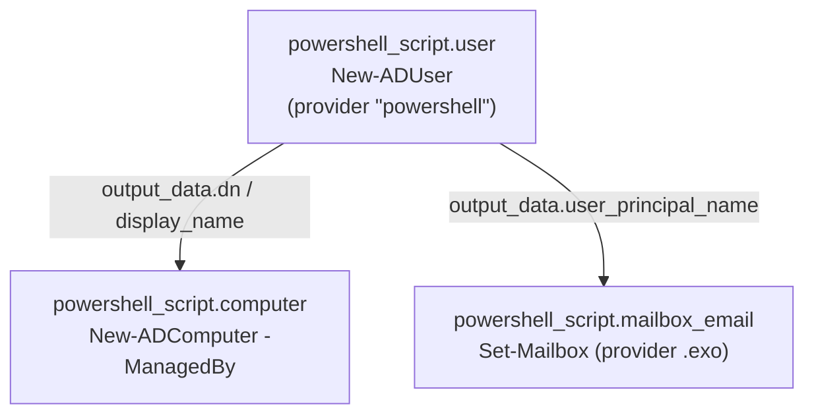

# Real-World Example: Provisioning a User Across AD and Exchange Online

This guide ties together the patterns from the
[provider](../index.md) and [resource](../resources/script.md) docs into one
realistic configuration. It provisions an identity in three steps:

1. **Create an Active Directory user** with the default provider (connected to a
   domain controller via the `ActiveDirectory` module).
2. **Create a related computer account** with the *same* provider, built from the
   user resource's output (the workstation's `ManagedBy` points at the user) — a
   second resource that depends on the first.
3. **Set the mailbox email address** with a *second* provider (`alias = "exo"`)
   connected to Exchange Online via the `ExchangeOnlineManagement` module.

The data flows in one direction. The user resource is the source of truth; the
computer account and the Exchange Online mailbox both read the user's
`output_data`, so Terraform sequences everything automatically:



## Providers

The default provider connects to on-prem Active Directory. The `exo` alias is a
**separate sidecar process** with its own `$global:ProviderState`, so it can't
see the AD credential — it authenticates to Exchange Online on its own. (See
[Isolation guarantees](../index.md#isolation-guarantees).)

```hcl
terraform {
  required_providers {
    powershell = { source = "markdomansky/powershell" }
  }
}

# Provider 1 — on-prem Active Directory (default configuration).
provider "powershell" {
  startup_script = <<-PS
    $global:ProviderState = @{}
    Import-Module ActiveDirectory

    # Service-account credential, interpolated from sensitive Terraform variables.
    $user = '${var.ad_admin_username}'
    $pass = ConvertTo-SecureString '${var.ad_admin_password}' -AsPlainText -Force

    $global:ProviderState["credential"] = [System.Management.Automation.PSCredential]::new($user, $pass)
    $global:ProviderState["server"]     = '${var.domain_controller}'
    $global:ProviderState["base_ou"]    = '${var.base_ou}'
  PS
}

# Provider 2 — Exchange Online, via the ExchangeOnlineManagement module.
provider "powershell" {
  alias = "exo"

  startup_script = <<-PS
    $global:ProviderState = @{}
    Import-Module ExchangeOnlineManagement

    # App-only certificate auth keeps the session non-interactive (CI-friendly).
    Connect-ExchangeOnline `
      -AppId                 '${var.exo_app_id}' `
      -CertificateThumbprint '${var.exo_cert_thumbprint}' `
      -Organization          '${var.exo_organization}' `
      -ShowBanner:$false

    $global:ProviderState["organization"] = '${var.exo_organization}'
  PS

  shutdown_script = <<-PS
    # Runs once, after the last resource on this alias. Close the EXO session.
    Disconnect-ExchangeOnline -Confirm:$false
  PS
}
```

## Variables

```hcl
variable "first_name" { type = string }
variable "last_name"  { type = string }

variable "department" {
  type    = string
  default = "Engineering"
}

variable "domain" {
  type        = string
  description = "UPN / primary-SMTP domain, e.g. contoso.com"
}

# --- Active Directory connection ---
variable "domain_controller" { type = string }
variable "base_ou"           { type = string } # e.g. OU=Staff,DC=contoso,DC=com
variable "ad_admin_username" { type = string }
variable "ad_admin_password" {
  type      = string
  sensitive = true
}

# --- Exchange Online (app-only) connection ---
variable "exo_app_id"          { type = string }
variable "exo_cert_thumbprint" { type = string }
variable "exo_organization"    { type = string } # e.g. contoso.onmicrosoft.com
```

> **Passwords are out of scope.** This configuration never sets a user password.
> The account is created disabled and is expected to be activated out-of-band by
> an existing self-service password reset (SSPR) / onboarding process. Keeping
> password set and reset outside the Terraform run avoids putting any credential
> into `input_data`, `output_data`, or the rendered script in state. See
> [Sensitive data](../resources/script.md#sensitive-data).

## Step 1 — Create the Active Directory user

The create script builds a deterministic `SamAccountName` / UPN and returns the
durable identifiers downstream resources need. The read/update scripts return the
**same shape** so a refresh never silently drops a key.

```hcl
resource "powershell_script" "user" {
  create_script = <<-PS
    $sam  = ('${var.first_name}.${var.last_name}').ToLower()
    $upn  = "$sam@${var.domain}"
    $name = '${var.first_name} ${var.last_name}'

    New-ADUser `
      -Server            $global:ProviderState["server"] `
      -Credential        $global:ProviderState["credential"] `
      -Path              $global:ProviderState["base_ou"] `
      -Name              $name `
      -GivenName         '${var.first_name}' `
      -Surname           '${var.last_name}' `
      -SamAccountName    $sam `
      -UserPrincipalName $upn `
      -Department        '${var.department}' `
      -Enabled           $false   # account stays disabled until a password is set

    # Note: this resource does NOT set a password. The account is created disabled
    # and is expected to be activated out-of-band by your self-service password
    # reset (SSPR) / onboarding process. Password set and reset are deliberately
    # outside this Terraform run.

    $u = Get-ADUser -Identity $sam `
      -Server $global:ProviderState["server"] -Credential $global:ProviderState["credential"]

    [PSCustomObject]@{
      id                  = $u.ObjectGUID.ToString()   # durable handle for R/U/D
      sam_account_name    = $u.SamAccountName
      user_principal_name = $u.UserPrincipalName
      display_name        = $u.Name
      distinguished_name  = $u.DistinguishedName
    }
  PS

  read_script = <<-PS
    $u = Get-ADUser -Identity $InputData.id -Properties Department `
      -Server $global:ProviderState["server"] -Credential $global:ProviderState["credential"] `
      -ErrorAction SilentlyContinue
    if ($u) {
      [PSCustomObject]@{
        id                  = $u.ObjectGUID.ToString()
        sam_account_name    = $u.SamAccountName
        user_principal_name = $u.UserPrincipalName
        display_name        = $u.Name
        distinguished_name  = $u.DistinguishedName
      }
    }
    # Emitting nothing -> Terraform sees the user is gone and plans to recreate it.
  PS

  update_script = <<-PS
    Set-ADUser -Identity $InputData.id -Department '${var.department}' `
      -Server $global:ProviderState["server"] -Credential $global:ProviderState["credential"]

    $u = Get-ADUser -Identity $InputData.id `
      -Server $global:ProviderState["server"] -Credential $global:ProviderState["credential"]

    [PSCustomObject]@{
      id                  = $u.ObjectGUID.ToString()
      sam_account_name    = $u.SamAccountName
      user_principal_name = $u.UserPrincipalName
      display_name        = $u.Name
      distinguished_name  = $u.DistinguishedName
    }
  PS

  delete_script = <<-PS
    Remove-ADUser -Identity $InputData.id -Confirm:$false `
      -Server $global:ProviderState["server"] -Credential $global:ProviderState["credential"]
  PS
}
```

## Step 2 — Create a computer account assigned to the user

Same provider, second resource. The workstation is provisioned *for the user that
was just created*: its `ManagedBy` attribute is set to the user's distinguished
name, and its `input_data` references `powershell_script.user.output_data`. That
reference is what makes Terraform create the user **first** and the computer
account **after** — no explicit `depends_on` needed.

Because `output_data` is a JSON string, pull individual fields back out with
`jsondecode()`.

```hcl
resource "powershell_script" "computer" {
  create_script = <<-PS
    $name  = $InputData.computer_name
    $owner = $InputData.owner_dn          # the user's distinguished name
    $desc  = "Workstation for $($InputData.display_name)"

    $c = New-ADComputer `
      -Server      $global:ProviderState["server"] `
      -Credential  $global:ProviderState["credential"] `
      -Path        $global:ProviderState["base_ou"] `
      -Name        $name `
      -ManagedBy   $owner `
      -Description  $desc `
      -Enabled     $true `
      -PassThru

    [PSCustomObject]@{
      id                 = $c.ObjectGUID.ToString()
      computer_name      = $c.Name
      managed_by         = $owner
      distinguished_name = $c.DistinguishedName
    }
  PS

  read_script = <<-PS
    $c = Get-ADComputer -Identity $InputData.id -Properties ManagedBy `
      -Server $global:ProviderState["server"] -Credential $global:ProviderState["credential"] `
      -ErrorAction SilentlyContinue
    if ($c) {
      [PSCustomObject]@{
        id                 = $c.ObjectGUID.ToString()
        computer_name      = $c.Name
        managed_by         = $c.ManagedBy
        distinguished_name = $c.DistinguishedName
      }
    }
  PS

  update_script = <<-PS
    Set-ADComputer -Identity $InputData.id -ManagedBy $InputData.owner_dn `
      -Server $global:ProviderState["server"] -Credential $global:ProviderState["credential"]

    $c = Get-ADComputer -Identity $InputData.id -Properties ManagedBy `
      -Server $global:ProviderState["server"] -Credential $global:ProviderState["credential"]

    [PSCustomObject]@{
      id                 = $c.ObjectGUID.ToString()
      computer_name      = $c.Name
      managed_by         = $c.ManagedBy
      distinguished_name = $c.DistinguishedName
    }
  PS

  delete_script = <<-PS
    Remove-ADComputer -Identity $InputData.id -Confirm:$false `
      -Server $global:ProviderState["server"] -Credential $global:ProviderState["credential"]
  PS

  # Built FROM the user resource's output. The reference creates the dependency.
  # NetBIOS computer names are capped at 15 characters, so the derived name is
  # truncated to stay within the limit.
  input_data = jsonencode({
    computer_name = substr(upper("WS-${var.first_name}${var.last_name}"), 0, 15)
    display_name  = jsondecode(powershell_script.user.output_data).display_name
    owner_dn      = jsondecode(powershell_script.user.output_data).distinguished_name
  })
}
```

## Step 3 — Set the email address in Exchange Online

The third resource selects the second provider with `provider = powershell.exo`,
so its scripts run in the Exchange Online sidecar where `Connect-ExchangeOnline`
already ran. It identifies the mailbox by the **UPN it reads from the user
resource's output**, crossing the provider boundary through `input_data` — the
sanctioned channel, since the two providers share no in-process state.

```hcl
resource "powershell_script" "mailbox_email" {
  provider = powershell.exo

  create_script = <<-PS
    $upn   = $InputData.user_principal_name
    $email = $InputData.email

    # Set the primary SMTP address (capital "SMTP:" marks it primary).
    Set-Mailbox -Identity $upn -WindowsEmailAddress $email
    Set-Mailbox -Identity $upn -EmailAddresses @{ add = "SMTP:$email" }

    $mbx = Get-Mailbox -Identity $upn
    [PSCustomObject]@{
      id             = $mbx.ExternalDirectoryObjectId   # stable EXO object id
      user_principal = $mbx.UserPrincipalName
      primary_smtp   = $mbx.PrimarySmtpAddress.ToString()
    }
  PS

  read_script = <<-PS
    $mbx = Get-Mailbox -Identity $InputData.id -ErrorAction SilentlyContinue
    if ($mbx) {
      [PSCustomObject]@{
        id             = $mbx.ExternalDirectoryObjectId
        user_principal = $mbx.UserPrincipalName
        primary_smtp   = $mbx.PrimarySmtpAddress.ToString()
      }
    }
  PS

  update_script = <<-PS
    Set-Mailbox -Identity $InputData.id -WindowsEmailAddress $InputData.email
    $mbx = Get-Mailbox -Identity $InputData.id
    [PSCustomObject]@{
      id             = $mbx.ExternalDirectoryObjectId
      user_principal = $mbx.UserPrincipalName
      primary_smtp   = $mbx.PrimarySmtpAddress.ToString()
    }
  PS

  delete_script = <<-PS
    # The mailbox itself is owned by the directory-synced user, not by this
    # resource. Deleting this resource just stops Terraform managing the address;
    # reset it here instead if your policy requires it.
  PS

  # The mailbox to touch, and the address to set, both come from the user output.
  input_data = jsonencode({
    user_principal_name = jsondecode(powershell_script.user.output_data).user_principal_name
    email               = jsondecode(powershell_script.user.output_data).user_principal_name
  })
}
```

## Outputs

```hcl
output "user_upn" {
  value = jsondecode(powershell_script.user.output_data).user_principal_name
}

output "computer_dn" {
  value = jsondecode(powershell_script.computer.output_data).distinguished_name
}

output "mailbox_primary_smtp" {
  value = jsondecode(powershell_script.mailbox_email.output_data).primary_smtp
}
```

## Applying it

```bash
export TF_VAR_ad_admin_password="…"
terraform init
terraform apply \
  -var 'first_name=Jane' \
  -var 'last_name=Doe' \
  -var 'domain=contoso.com'
```

## How the pieces connect

- **One provider, two resources, real ordering.** `computer` reads
  `powershell_script.user.output_data`, so Terraform builds the user before the
  computer account. This is an *explicit* dependency edge in the graph — unlike
  sharing data through `$global:ProviderState`, which has
  [no guaranteed ordering](../index.md#sharing-state-across-multiple-resources)
  between resources. When one resource must consume another's result, pass it
  through `input_data`, not provider state.

- **`computer` and `mailbox_email` are independent.** Both depend only on `user`,
  not on each other, so Terraform may create them in either order (or in
  parallel).

- **Two providers, isolated by design.** `powershell.exo` runs in its own sidecar
  and cannot read the AD provider's `$global:ProviderState`. Anything Exchange
  Online needs from the AD side travels as plain data through `input_data` (here,
  the UPN). Each provider's `startup_script` establishes its own connection, and
  the `exo` `shutdown_script` closes the EXO session once after the last resource
  on that alias.

- **Stable ids, stable shapes.** Every create returns a durable `id`
  (`ObjectGUID`, `ExternalDirectoryObjectId`) that read/update/delete resolve back
  to the real object, and each read returns the same keys as its create so
  refreshes don't churn state. See
  [Accessing the existing object](../resources/script.md#accessing-the-existing-object-read-update-delete).

## Packaging this as modules

The configuration above is shown inline so the whole flow reads top to bottom. In
practice, bundling each object type as its own module — its CRUD `.ps1` files,
typed variables, and outputs together — keeps the root module to just the wiring.
A complete, runnable version lives in
[`examples/real-world-user-provisioning`](../../examples/real-world-user-provisioning):

```text
real-world-user-provisioning/
├── main.tf                      # providers + module composition + outputs
├── variables.tf
└── modules/
    ├── ad-user/                 # New-ADUser      (default provider)
    ├── ad-computer/             # New-ADComputer  (default provider)
    └── exo-mailbox-email/       # Set-Mailbox     (powershell.exo alias)
```

With that structure the root module collapses to module calls, and the
dependency edges become module references:

```hcl
module "user" {
  source = "./modules/ad-user"

  first_name = var.first_name
  last_name  = var.last_name
  department = var.department
  domain     = var.domain
}

module "computer" {
  source = "./modules/ad-computer"

  computer_name      = substr(upper("WS-${var.first_name}${var.last_name}"), 0, 15)
  owner_dn           = module.user.distinguished_name   # depends on the user
  owner_display_name = module.user.display_name
}

module "mailbox_email" {
  source = "./modules/exo-mailbox-email"

  # Bind the module's exo slot to the aliased configuration.
  providers = {
    powershell.exo = powershell.exo
  }

  user_principal_name = module.user.user_principal_name # depends on the user
  email               = module.user.user_principal_name
}
```

The `exo-mailbox-email` module declares the second provider as a *slot* the caller
fills, exactly as in
[Using two provider aliases in a submodule](../index.md#using-two-provider-aliases-in-a-submodule):

```hcl
# modules/exo-mailbox-email/main.tf
terraform {
  required_providers {
    powershell = {
      source                = "markdomansky/powershell"
      configuration_aliases = [powershell.exo]   # caller binds this slot
    }
  }
}

resource "powershell_script" "this" {
  provider = powershell.exo
  # create/read/update/delete = file("${path.module}/scripts/…")
  # ...
}
```

The CRUD scripts become plain `.ps1` files loaded with `file()`. Because `file()`
reads them verbatim — no `${var.…}` interpolation — every value they need arrives
through `input_data` (and the shared connection through `$global:ProviderState`),
which is the more testable and secret-safe pattern. See
[Passing variables to script files](../resources/script.md#passing-variables-to-script-files).
